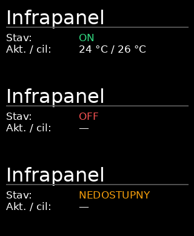

# HanzHub IoT

Samostatná služba pro lokální ovládání a správu chytrých modulů v HanzHubu. Běží na Raspberry Pi jako kontejner `hanzhub_iot`, výchozí port je **4011**. Repo se jmenuje **LoT**, aplikace používá název **IoT moduly**.

Web zachovává styl stávajícího HanzHubu: tmavé pozadí s barevnými přechody, průsvitné karty, logo HanzHub a zelené akce. Ovládání infrapanelu má velkou cílovou teplotu s kruhovým ukazatelem, aktuální teplotu, tlačítka ±, posuvník, zapnutí, dětský zámek a časovač. Funguje na počítači i telefonu.

**Verze 1.1.0:** přidává lokální ovládání zásuvky **TP-Link Tapo P110M** přes `python-kasa`, aktuální příkon ve W a spotřebu za den a měsíc v kWh. Zachovává oranžovou ikonu a kompaktní hlavičku z verze 1.0.1.

Součástí je správa modulů: přidání ze souboru TinyTuya nebo ručně, pojmenování, místnost, úprava IP a protokolu, obnova klíče či účtu, pozastavení a odebrání. Podporován je infrapanel **BOT SMART IPH2**, obecný **spínač / zásuvka Tuya** s nastavitelným boolean DP zapnutí a **TP-Link Tapo P110M**. Další typy lze doplnit ovladačem; automatický univerzální ovladač pro všechny IoT výrobky není součástí této verze.

## Zapojení

| Část | Adresa / port | Úloha |
| --- | --- | --- |
| Notebook s LTE Share | `192.168.1.2` | Brána a DHCP v LAN |
| Zyxel jako přístupový bod | LAN, DHCP vypnuté | Propojuje Wi-Fi a kabelovou síť |
| Raspberry HanzHub | `192.168.1.3` | Hostitel služeb |
| Existující dashboard | `http://192.168.1.3:4001` | Rozcestník a nová karta / záložka IoT |
| Existující HanzHub API | `http://127.0.0.1:4010` | Registrace karty a její health check |
| Nová IoT služba | `http://192.168.1.3:4011` | Web, správa a lokální ovládání |
| Infrapanel | poslední potvrzená `192.168.1.102` | Tuya protokol 3.4 |

IoT používá hostitelskou síť Dockeru, aby dosáhlo na zařízení v LAN. K běžnému ovládání nepotřebuje Tuya ani Tapo cloud. Pro Tuya z wizardu načte ID a lokální klíč; pro Tapo lokálně ověří údaje TP-Link účtu. Původní aplikace lze dál používat.

## Instalace na HUB

Předpoklady: Linux na Raspberry Pi, `git`, Python 3, Docker s pluginem **Docker Compose v2**, běžící stávající dashboard a funkční soubor `/opt/infrapanel/devices.json` z TinyTuya wizardu. Soubor už obsahuje lokální klíč tvého úspěšně vyzkoušeného panelu. Instalátor jej nikam neposílá.

```bash
cd /opt
git clone https://github.com/H0nz4k/LoT.git hanzhub-iot
cd /opt/hanzhub-iot
sudo sh install.sh --with-lcd
```

U soukromého repozitáře použij své obvyklé přihlášení do GitHubu nebo SSH URL. Klíče a tokeny nepatří do repozitáře.

Instalace:

1. Vytvoří `.env`, pokud chybí; existující konfiguraci zachová.
2. Ověří lokální `devices.json`, sestaví a spustí **jen** samostatný Compose projekt IoT.
3. Při prvním startu rozpozná tvůj panel podle MAC `fc:3c:d7:4c:a2:dc` a naimportuje jeho ID a klíč.
4. Přidá kartu **IoT moduly** do stávajícího dashboardu, pokud ještě neexistuje. Přidá také záložky **Služby / IoT**, ikonu a přesměrovací stránku. Původní `index.html` zálohuje mimo statický web. U IoT karty obnoví spravovanou ikonu; názvy, odkazy a ostatní nastavení zachová. Ikona je uložená přímo v konfiguraci karty, takže funguje i bez kopie SVG v adresáři dashboardu.
5. S `--with-lcd` najde skutečný `lcd_info.py` ve službě `lcd-info.service`, zálohuje jej, doplní helper a restartuje tuto službu. Systémovou jednotku nenahrazuje.

Pak otevři **[http://192.168.1.3:4011](http://192.168.1.3:4011)** nebo novou kartu v HanzHubu. Kartu nemusíš přidávat ručně. Po instalaci dashboard jednou obnov v prohlížeči.

Pokud chceš nejdřív spustit samotný web, použij `sudo sh install.sh` a LCD doinstaluj později. `--skip-dashboard` spustí samostatnou službu bez úprav dashboardu.

### Když autodetekce nestačí

Skutečný adresář dashboardu se zjišťuje z mountu kontejneru `hanzhub_dashboard`. Pokud se kontejner jmenuje jinak, zadej cestu ke statickému webu obsahujícímu `index.html`:

```bash
sudo sh install.sh --dashboard-dir /skutecna/cesta/dashboard/site
```

Dodaná kopie `lcd-info.service` byla prázdná. Instalátor proto přečte `ExecStart` **existující** služby. Jestli cesta není absolutní nebo služba používá jiné jméno, zadej skutečné hodnoty:

```bash
sudo python3 lcd/install_lcd.py \
  --script /skutecna/cesta/lcd_info.py \
  --service lcd-info.service
```

Při neúspěchu integrace zůstává IoT služba spuštěná a instalátor vrátí chybu s postupem. Opravenou integraci lze spustit samostatně:

```bash
sudo python3 integrations/dashboard.py --directory /skutecna/cesta/dashboard/site
```

## Konfigurace a aktualizace

Výchozí hodnoty jsou v `.env.example`; instalátor je zkopíruje do `.env`. Při změně portu uprav také URL služby. Při změně IP HUBu uprav obě uživatelské URL.

| Proměnná | Výchozí hodnota |
| --- | --- |
| `HANZHUB_IOT_PORT` | `4011` |
| `HANZHUB_IOT_URL` | `http://192.168.1.3:4011` |
| `HANZHUB_DASHBOARD_API` | `http://127.0.0.1:4010` |
| `HANZHUB_DASHBOARD_URL` | `http://192.168.1.3:4001` |
| `TINYTUYA_DEVICES_FILE` | `/opt/infrapanel/devices.json` |

```bash
cd /opt/hanzhub-iot
sudo sh update.sh --with-lcd
```

Aktualizace používá `git pull --ff-only` a znovu instalaci. Databáze a `.env` se zachovají. U existující IoT karty instalátor obnoví ikonu a zachová ostatní ruční úpravy; změněnou URL pak nastav v nastavení dashboardu. Aktualizace starého repozitáře Dashboard může přepsat doplněnou navigaci: znovu spusť `integrations/dashboard.py`. Karta uložená přes API zůstává v původním `services.json`.

Služby jsou oddělené: tlačítka Dockeru ve starém dashboardu ovládají jeho vlastní Compose projekt. IoT aktualizuj nebo restartuj z `/opt/hanzhub-iot`:

```bash
docker compose ps
docker compose logs --tail=80 hanzhub_iot
docker compose restart hanzhub_iot
```

## Používání a správa modulů

- **Ovládání:** vyber modul vlevo. Stav se načítá po 15 sekundách. Tlačítko Obnovit vyžádá aktuální stav. Změna teploty se odešle po krátké pauze; po zápisu se znovu přečte panel a ověří se potvrzení. Při chybě se požadavek neoznačí jako úspěšný.
- **Správa modulů:** uprav název, místnost nebo adresu. Prázdný klíč při úpravě zachová existující klíč. Pozastavení přeruší dotazování a ovládání; samo zařízení nevypne. Odebrání odstraní registraci v HanzHubu, párování v původní aplikaci nemění.
- **Přidat modul → Z TinyTuya:** nabízí zařízení v lokálním `devices.json`. Vyber podporovaný typ, zkontroluj LAN IP a verzi protokolu. Neznámým spínačům přiřaď správné DP zapnutí z jejich modelu.
- **Načíst z TinyTuya:** obnoví ID a klíče známých modulů podle ID/MAC a přidá rozpoznaný BOT panel. Ostatní zařízení zůstanou nabídkou pro ruční výběr typu. Přejmenování, místnost a ručně nastavenou IP zachová.
- **Přidat modul → TP-Link Tapo P110M:** vyplň IP a účet Tapo. HanzHub zásuvku lokálně rozpozná, ověří přihlášení a uloží její skutečné ID/MAC. Při přidávání ji nezapíná ani nevypíná. Úprava názvu nebo IP s prázdným e-mailem i heslem zachová uložený účet; pro změnu účtu vyplň obě pole.
- **Po novém párování:** zařízení může dostat nové ID i klíč. Na HUBu spusť wizard, obnov mount souboru a ve správě klikni na Načíst z TinyTuya. Zkontroluj také IP zařízení.

```bash
cd /opt/infrapanel
/opt/infrapanel/.venv/bin/python -m tinytuya wizard
cd /opt/hanzhub-iot
docker compose up -d --force-recreate hanzhub_iot
```

Rekonstrukce kontejneru po wizardu pokryje i případ, kdy byl `devices.json` nahrazen novým souborem. Klíč pak obnov tlačítkem ve správě.

`ON` znamená zapnutý panel. Z dostupných DP nelze spolehlivě odvodit, zda právě odebírá výkon a topí. Aplikace tento údaj nevymýšlí. Stav Nedostupný je odlišný od Vypnuto. Při spuštění, importu nebo pravidelném čtení se žádný příkaz k zapnutí automaticky neposílá.

## Přidání TP-Link Tapo P110M

1. V aplikaci **Tapo** přidej zásuvku a připoj ji na **2,4GHz Wi-Fi HanzHub**, ve stejné LAN jako Raspberry. Po prvním nastavení můžeš dál používat aplikaci Tapo.
2. V informacích o zásuvce nebo v DHCP seznamu zjisti její LAN IP. Je vhodné mít pro ni stálou adresu / DHCP rezervaci.
3. Aktualizuj HanzHub IoT:

   ```bash
   cd /opt/hanzhub-iot
   sudo sh update.sh
   ```

4. Otevři [IoT moduly](http://192.168.1.3:4011), obnov stránku **Ctrl+F5** a zvol **Přidat modul → TP-Link Tapo P110M**.
5. Vyplň název, místnost, IP, **e-mail a heslo TP-Link účtu z aplikace Tapo**. Jde o účet Tapo; formulář nepoužívá heslo Wi-Fi ani Matter QR kód. Údaje zadávej přímo do HanzHubu.
6. Klikni **Přidat modul**. Při prvním ověření musí být zásuvka dostupná. MAC a ID se načtou automaticky; po změně DHCP adresy ověříme stejnou identitu před každým ovládáním.

Na kartě najdeš **ON/OFF**, aktuální příkon **W**, spotřebu **dnes / tento měsíc v kWh** a dostupné měření **V / A**. Nedostupné hodnoty mají `—`, nikoli vymyšlenou nulu. `ON` označuje sepnuté relé; příkon je samostatný údaj ze zásuvky. Změna zapnutí se potvrdí novým čtením stavu.

Pokud Tapo odmítne přihlášení se správnými údaji, zkontroluj v aplikaci **Já / Me → Služby třetích stran / Third-Party Services → Kompatibilita třetích stran / Third-Party Compatibility**. Nabídka závisí na verzi aplikace a firmwaru. Viz [postup TP-Link](https://www.tp-link.com/us/support/faq/4416/). Není potřeba mazat DHCP ani znovu nastavovat infrapanel.

Ovladač používá lokální TP-Link protokol přes [python-kasa](https://python-kasa.readthedocs.io/en/stable/); služba při ovládání nevolá Tapo cloud. Připojení fyzické P110M je nutné ověřit na tvém HUBu. Podporu modelu uvádí [seznam knihovny](https://python-kasa.readthedocs.io/en/stable/SUPPORTED.html).

## Ověřené DP infrapanelu

Model byl získán z Tuya thing model API; uživatel na skutečném panelu potvrdil lokální čtení a nastavení cíle na 26 °C přes TinyTuya 3.4.

| DP | Význam | Hodnoty | Přístup |
| --- | --- | --- | --- |
| 1 | Zapnutí | boolean | čtení / zápis |
| 2 | Dětský zámek | boolean | čtení / zápis |
| 3 | Cílová teplota | 0–37 °C, krok 1 | čtení / zápis |
| 4 | Aktuální teplota | 0–99 °C | jen čtení |
| 5 | Odpočet | 0–1440 minut, zápis po 60 minutách | čtení / zápis |
| 6 | Porucha | bitmap, bit 1 = E1 teplotní čidlo | jen čtení |

Časovač se zadává v hodinách; běžící odpočet může vracet libovolné minuty. Zapnutí, zámek a časovač jsou implementované podle potvrzeného modelu a testované se simulovaným transportem. **Jejich fyzické chování na tomto panelu ještě zbývá vyzkoušet.** UI ani API neumožňují zápis do DP 4/6.

## LCD místo LoRa

`lcd/lcd_info.py` vychází z dodaného skriptu. Zachovává framebuffer, rotaci, CPU, RAM, disk, uptime, IP a Meteo. Původní LoRa sekce se změní na:

- **ON zeleně** a `Akt. / cil: 24 °C / 26 °C` při zapnutém dostupném panelu (čísla jsou příklad).
- **OFF červeně**, pokud panel odpověděl, že je vypnutý.
- **NEDOSTUPNY oranžově**, pokud API/panel neodpovídá, údaje nejsou úplné nebo jsou zastaralé.
- Příznak **E1** při poruše čidla.

Dotazování běží na pozadí, takže síťový výpadek nezastaví obnovování systémových údajů na LCD. Staré argumenty `--lora_www` a `--lora_refresh` se přijmou kvůli kompatibilitě se stávající službou, ale už nejsou používané.

Náhled tří stavů (příklad hodnot, nikoli živé měření):



Nové volitelné argumenty LCD:

| Argument | Výchozí hodnota |
| --- | --- |
| `--infrapanel_api` | `http://127.0.0.1:4011/api/iot/panel` |
| `--infrapanel_refresh` | `5` sekund |
| `--infrapanel_id` | rozpoznaný BOT panel, případně první přidaný infrapanel |

Při změně portu uprav `--infrapanel_api` v existujícím `ExecStart`. Pro více panelů můžeš určit ID modulu z API `/api/iot/devices`.

Instalátor vypíše adresář `lcd-backup-…` s původními soubory. Obnovu provedeš vrácením původního `lcd_info.py` z této zálohy a restartem své LCD služby. Jednotka systemd ani nastavení LCD overlay se během instalace nemění.

## Data a přístup

Registrace modulů, lokální klíče, účty Tapo a posledních 500 příkazů jsou v SQLite v Docker volume `hanzhub-iot_iot_data`, uvnitř kontejneru `/var/lib/hanzhub-iot/modules.sqlite3`. Adresář má režim 0700 a databáze 0600. Účty i klíče jsou v databázi uloženy čitelně pro provoz služby; patří do neveřejné zálohy. Restart, aktualizace ani běžné `docker compose down` data nemažou. Příkaz `docker compose down -v` by volume s registrací odstranil. Přechod z 1.0.x automaticky doplní sloupce pro Tapo a zachová moduly, klíče i historii.

`devices.json` je připojen pouze ke čtení. Cloudové API údaje z `tinytuya.json` aplikace nepoužívá. Klíče ani účet Tapo nejsou v odpovědích API, logu, statickém webu ani GitHubu. Formulář účtu se při zavření vymaže a neposílá se do localStorage. Veřejné API vrací pouze příznak `has_credentials`.

Ovládání, správa a stavové API jsou dostupné z LAN a loopbacku; požadavky z veřejné IP předané přes Cloudflare se odmítají. Ovládání přes internet zatím není součástí této verze. UI a API běží na stejné adrese a portu, nepotřebují CORS proxy.

## API

| Metoda | Cesta | Úloha |
| --- | --- | --- |
| GET | `/api/iot/health` | Dostupnost služby, nikoli samotného panelu |
| GET | `/api/iot/devices` | Registrované moduly bez klíčů |
| GET | `/api/iot/candidates` | Nabídka z TinyTuya bez klíčů |
| POST | `/api/iot/devices` | Přidat modul |
| PUT / DELETE | `/api/iot/devices/{id}` | Upravit / odebrat modul |
| GET | `/api/iot/devices/{id}/state?fresh=1` | Aktuální stav |
| POST | `/api/iot/devices/{id}/command` | Příkaz a následné potvrzení stavem |
| POST | `/api/iot/import` | Obnovit klíče z lokálního souboru, tělo `{}` |
| GET | `/api/iot/panel` | Stav panelu pro LCD, volitelně `?id=…` |
| GET | `/api/iot/events?id=…` | Poslední příkazy modulu |

Tělo příkazu například: `{"control":"target_temp_c","value":26}`. Podporované řídicí položky panelu jsou `power`, `locked`, `target_temp_c`, `timer_minutes`. Zápisy vyžadují `Content-Type: application/json`. Chyby jsou vráceny jako `{error, code}`; výpadek zařízení při čtení jako `state.online=false`.

## Vývoj a ověření

```bash
python3 -m venv .venv
.venv/bin/python -m pip install -r iot/requirements.txt
.venv/bin/python -m unittest discover -s tests -v
python3 -m compileall -q iot lcd integrations install.py
node --check web/iot.js
sh -n install.sh update.sh
docker compose config --quiet
```

Testy pokrývají mapování DP, rozsahy a typy, potvrzování zápisu, timer, poruchy, výpadek, registr a obnovu klíče po párování, serializaci příkazů, HTTP API, skrytí klíčů a účtů, LCD i opakované napojení dashboardu. Tapo testy ověřují čtení a potvrzené přepnutí, zaměněnou zásuvku na stejné IP, chyby autentizace, obnovu účtu a migraci původní databáze. Ověřují také jednotky přímo na Energy modulu připnuté knihovny. Používají výslovně testovací transport a žádné skutečné zařízení nezapínají. GitHub Actions tyto kontroly spouští při pushi i PR.

Ve verzi 1.1.0 prošlo 45 automatických testů a kontrola syntaxe Python/JavaScript/shell. V prostředí přípravy nebyl Docker ani přístup k framebufferu Raspberry; sestavení ARM kontejneru, skutečné LCD a ovládání fyzické zásuvky je nutné ověřit na HUBu. Cloudový prohlížeč zde nepovolil přístup k lokálnímu portu pro vizuální ověření webu.

Zdroje: [TinyTuya](https://github.com/jasonacox/tinytuya), [potvrzený Tuya thing model endpoint](https://developer.tuya.com/en/docs/cloud/bd68171262?id=Kcp4utbhzzfgo), [původní HanzHub Dashboard](https://github.com/H0nz4k/Dashboard).
